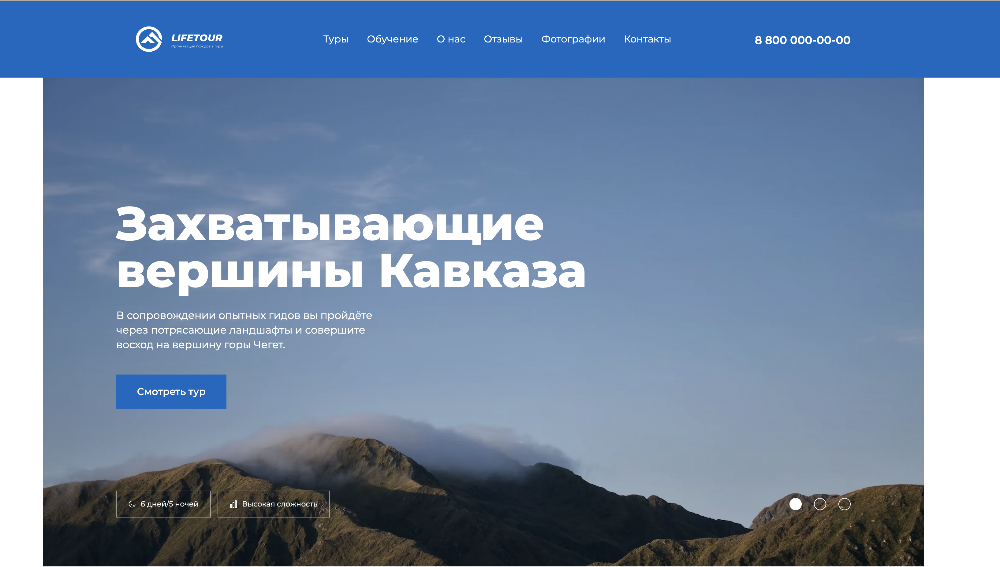

# accelerator-second-project

Лендинг для туристической фирмы.

В рамках проекта была реализована адаптивная вёрстка сайта с использованием методологии БЭМ и препроцессора Sass (SCSS). Основной акцент был сделан на кроссбраузерность (Chrome, Firefox) и корректное отображение на всех устройствах: мобильных (320px — 767px), планшетных (768px — 1439px) и десктопных (от 1440px и выше).

Ключевые особенности проекта:

Адаптивность и фиксированная ширина контейнера: Вёрстка сохраняет целостность при изменении масштаба страницы, а фоны, упирающиеся в края макета, растягиваются на всю ширину страницы.

Интерактивные компоненты: Реализованы слайдеры (с использованием библиотеки Swiper.js), бургерное меню и форма с валидацией. Все элементы взаимодействия работают как с помощью мыши, так и с клавиатуры.

Динамические элементы: В блоке "Промо" слайдер зациклен и переключается свайпом на мобильных устройствах и буллетами на десктопе. В блоке "Преимущества" карточки становятся слайдером в десктопном варианте, переключаются по два слайда и зациклены.

Форма с валидацией: В блоке "Остались вопросы?" реализована форма с обязательными полями (Телефон, Email), валидацией ввода (только цифры для телефона, только email для соответствующего поля) и отправкой данных методом POST. Ошибки валидации выводятся с подсветкой полей.

Доступность: Учтены требования по доступности для скринридеров (скрытие дублирующего текста у заголовков).

Технические детали:

Использовалась предоставленная сборка без модификаций.

Для стилизации контентных элементов применялся каскад, без добавления лишних классов.

В проекте использовался шрифт Montserrat.

Все интерактивные элементы (телефон, email, кнопки) соответствуют требованиям заказчика.

Результат:
Проект демонстрирует навыки работы с современными инструментами вёрстки, внимание к деталям и умение реализовывать сложные интерактивные компоненты с учётом требований доступности и кроссбраузерности.

Ссылка на сайт: [тут](https://dxenium.github.io/HTML-Academy-Accelerator-project-2/)

